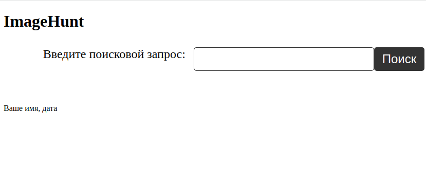

### ImageHunt

___
Це проста пошукова система зображень, яку використовує [API Google Custom Search](https://developers.google.com/custom-search/docs/basics?hl=ru). Користувач вводить запит у форму пошуку на головній сторінці, а потім результати відображаються у вигляді сітки зображень. Користувач може натискати на кнопки "Previous" та "Next", щоб перейти до попередньої або наступної сторінки результатів пошуку.

Сама програма складається з трьох файлів:  ***index.html***, ***style.css*** и ***script.js***:
* У ***index.html*** визначено форму пошуку, результати пошуку та кнопки для навігації по сторінках результатів.
* Ще ***index.html*** містить код [___HTML-сторінки___](https://developer.mozilla.org/ru/docs/Learn/HTML/Introduction_to_HTML/Document_and_website_structure) додатку ***ImageHunt***. Він складається з кількох основних блоків:

* Блок метаданих сторінок, де визначаються основні властивості документа, такі як кодування, мова, опис, ключові слова та заголовок.

* Блок із підключеними стилями та скриптами, що включає файли ***style.css*** та ***script.js***. Файл ***style.css*** містить стилі для оформлення сторінки, а файл ***script.js*** містить [***JavaScript-код***](https://developer.mozilla.org/ru/docs/Learn/JavaScript/First_steps/What_is_JavaScript), який обробляє форму пошуку та надсилає запит на сервер.

* Основний блок сторінки, який містить форму пошуку та контейнер для результатів пошуку.

* Блок підвалу, де вказується автор та дата створення сторінки.

Форма пошуку реалізована за допомогою [Google Custom Search Engine (CSE)](https://developers.google.com/custom-search/v1/cse?hl=ru), який надає ***API*** для пошуку зображень у [Google Images](https://images.google.com/). Користувач вводить запит у текстове поле, а потім натискає кнопку ***"Пошук"***. ***JavaScript-код*** отримує значення запиту та відправляє його на сервер ***CSE*** за допомогою ***API***. Результати пошуку відображаються у контейнері ***"results"*** на сторінці.
___

Нарешті, файл  ***script.js*** містить всю логіку програми, включаючи відправлення запитів до ***API Google Custom Search***, обробку результатів та зміну сторінки відповідно до натискання кнопок ***"Previous"*** та ***"Next"***.
* Файл ***style.css*** містить стилі для всіх елементів, визначених у ***index.html***. Файл ***style.css*** встановлює стилі для ***HTML-сторінки***, що містить форму пошуку та результати пошуку. Він визначає стилі для заголовка першого рівня ***(h1)***, форми пошуку, кнопки пошуку, результату пошуку та зображень.

* Зокрема, він задає шрифти, колір фону, розміри елементів, відступи, межі та ефекти тіні. Він також містить медіа-запит адаптивної верстки на пристроях з невеликим екраном.

___

Загальне враження від програми - це простий і ефективний спосіб швидкого пошуку зображень за допомогою ***Google Custom Search API***.

***Нижче представлений скріншот першої версії програми***

___
Реалізація додатку через платформу [Google Cloud Platform](https://console.cloud.google.com/)

## Створеня проекту та налаштування ***Custom Search API*** у ***Google Console*** та створеня ***API-key*** та ***CX***

* Перейдіть на сторінку [Google Console](https://console.developers.google.com/)
* Створіть новий проект, натиснувши кнопку "Select a Project" у верхній панелі та вибравши "New Project".
* Введіть ім'я проекту та натисніть кнопку "Create".
* Дочекайтеся, доки проект буде створено.
* У бічному меню виберіть [API та сервіси](https://console.cloud.google.com/apis/library?pli=1) > "Бібліотека".
Знайдіть "Custom Search API" та натисніть на неї.
* Натисніть кнопку "Увімкнути".
* У бічному меню виберіть "API та сервіси" > "Облікові дані".
* Натисніть кнопку "Створити облікові дані" та виберіть "Ключ API".
* Виберіть тип ключа "JSON".
* Збережіть файл JSON у безпечному місці на вашому комп'ютері.
* Перейдіть на сторінку "Setup" [Custom Search API](https://programmablesearchengine.google.com/about/)
* Натисніть кнопку "Add" поруч із "Sites to search".
* Вкажіть адресу вашого сайту та натисніть "Create".
* Знайдіть ID пошукового движка (CX) на сторінці налаштувань.
___

* Створіть проект у Google Cloud Console, якщо ви цього ще не зробили. Для цього перейдіть на https://console.cloud.google.com/projectcreate та виберіть назву проекту.
* Активуйте [Cloud Shell](https://cloud.google.com/shell), натиснувши на іконку оболонки у верхньому правому кутку вікна [Cloud Console](https://cloud.google.com/cloud-console).
* Клонуйте свій репозиторій за допомогою команди git clone <url-репозиторія>.
* Перейдіть до папки ***ImageHunt*** за допомогою cd ImageHunt.
* Створіть у цій директорії файл ***requirements.txt***. Встановіть усі залежності, вказані у файлі ***requirements.txt*** за допомогою команди ***pip install -r requirements.txt***.
* Створіть новий екземпляр віртуальної машини, виконавши команду gcloud compute instances create <ім'я-віртуальної-машини> --machine-type=n1-standard-1 --image-project=debian-cloud --image-family=debian-10 -- boot-disk-size=10GB.
* Завантажте код програми на віртуальну машину, виконавши команду ***gcloud compute scp main.py <ім'я-віртуальної машини>:~/ImageHunt/***.
* Налаштуйте брандмауер, дозволивши вхідний трафік на порт 80, виконав команду ***gcloud compute firewall-rules create allow-http-target-tags=http-server***.
* Запустіть програму, виконавши команду ***python3 main.py***-(ім'я вашого файлу).
* Перевірте, чи працює ваш додаток, перейшовши за адресою http://<зовнішня-ip-адреса-віртуальної-машини>:80 у браузері.
